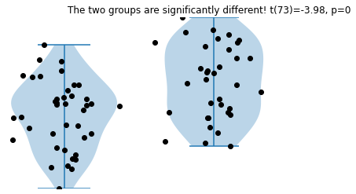

# Master statistics and machine learning: Intuition, Math, code

## Section 1.1 | Introduction | Guess the Test!

This is based upon the course by **Mike X Cohen** on *Udemy.com*. 

In this exercise, you can set parameters and generate random samples that will comprise two distinct groups. A **two-sample t-test** determines whether the means of the two groups are the same, or are different.

Finally, a violin plot demonstrates each group distribution visually.


```python
# Import libraries
import matplotlib.pyplot as plt
import numpy as np
import scipy.stats as stats
```

### Specify parameter values


```python
# Specify the averages of the two groups
average_group1 = 40
average_group2 = 45

# The amount of individual variability
standard_deviation = 5.6

# Sample sizes for each group
samples_group1 = 40
samples_group2 = 35
```

You don't need to change the code below here!

Although you are welcome to if you like ;)


```python
# Generate the data
data_group1 = np.random.randn(samples_group1)*standard_deviation + average_group1
data_group2 = np.random.randn(samples_group2)*standard_deviation + average_group2

# convenient collection of sample sizes
ns = [ samples_group1, samples_group2 ]

datalims = [np.min(np.hstack((data_group1,data_group2))), np.max(np.hstack((data_group1,data_group2)))]

# Note 1: np.random.randn(n) generates n random numbers from the standard normal distribution
# Note 2: numpy.random.rand(n) generates n number from the from a uniform distribution (in the range [0,1))
```

    [44.1189693  46.32853733 38.87576839 47.59882343 48.80912742 45.24571407
     42.91817761 41.08192427 38.68377427 52.88157539 49.10493831 51.96371795
     48.09054641 37.81657234 43.66805538 27.72639678 41.63803052 47.59953133
     42.06271701 45.60517784 35.76461375 44.04569269 44.77800231 43.05091986
     54.89190248 31.98688677 42.16713113 47.50875251 43.29994997 46.78431942
     47.9583658  33.65138445 48.74674988 43.22847171 41.86213118]
    


```python
## this section is for data visualization (don't need to modify)

fig,ax = plt.subplots(1,2,figsize=(6,4))

ax[0].violinplot(data_group1)
ax[0].plot(1+np.random.randn(samples_group1)/10,data_group1,'ko')
ax[0].set_ylim(datalims)
ax[0].axis('off')

ax[1].violinplot(data_group2)
ax[1].plot(1+np.random.randn(samples_group2)/10,data_group2,'ko')
ax[1].set_ylim(datalims)
ax[1].axis('off')


# 2-group t-test
t,p = stats.ttest_ind(data_group1,data_group2)

# Print the information to the title
sigtxt = ('',' NOT')
plt.title('The two groups are%s significantly different! t(%g)=%g, p=%g'%(
           sigtxt[int(p>.05)],sum(ns)-2,np.round(t,2),np.round(p,3))
         )

plt.show()

# Note: int(p > .05) returns True or False, then converting this to 1 or 0, depending on the value of p. 
# This is used as the index value in sigtxt[], and returns either '' or 'NOT', respectively  
```


    

    

